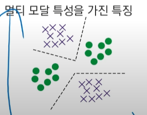

# 인공지능 입문 및 실습
### 4차 산업혁명
정보통신기술의 융합으로 이루어낸 혁명 시대

## AI(Artificial Intelligence)
지능적 행동을 자동화 하기 위한 컴퓨터 과학의 한 분야

인공지능은 지식 기반 방법론,데이터기반 방법, 지식-데이터 융합 방법이 있다.
 
 

IoT(Internet of Things)

~왜 인공지능을 배워야하나 사례소개

파이썬 기초문법 실습
super(class,self)