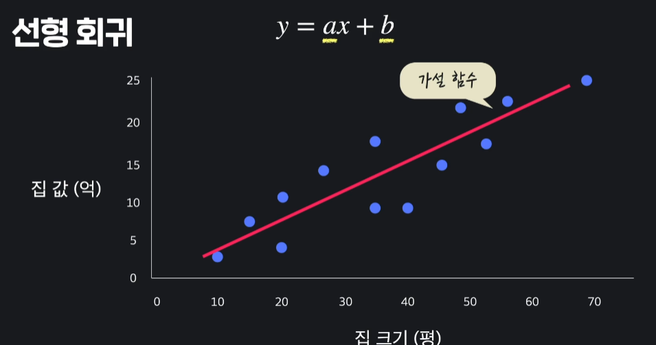
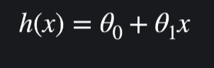
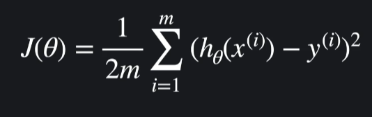
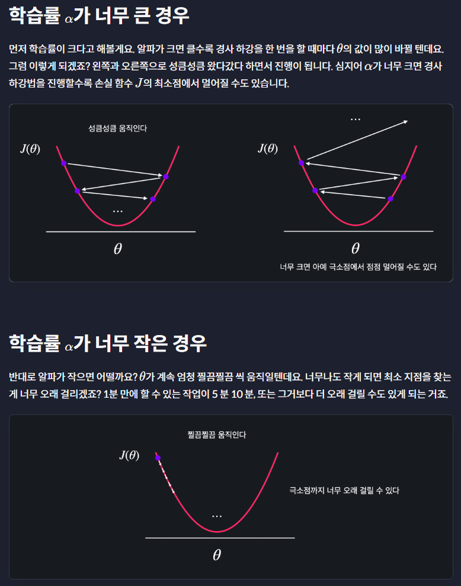
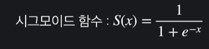
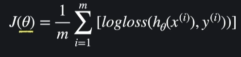

# 머신러닝
말그대로 기계학습으로 스스로 경험을하고 능력을 키우는것이다. 프로그램은 인간이 규칙을 알려주는것이고 머신러닝은 컴퓨터가 스스로 규칙을 알아내는것이다.

* 지도학습 : 답이 있고 이 답을 맞추는게 목적이다.
    * 분류 : 2옵션중에 하나를 맞추는것 (ex.스팸)
    * 회귀 : 다양한 옵션중에 하나를 맞추는것 (ex.아파트값)
* 비지도학습 : 답이 없고 이 답을 맞추는게 학습의 목적

## 선형회귀
가로 세로 데이터가 있을때 이 데이터들을 표현해주는 가장 적절한 선을 찾는것이다. 최적선이라고 말하기도 한다.

### 가설 함수
선형 회귀하면서 중간중간에 시도하는 함수들을 가설 함수라고 부른다.

가설 함수에는 일반적인 y=ax+b 대신에 조금 다른 변수를 사용한다.

수많은 변수들을 표현하기 편해서 세타로 표현함.

### 평균 제곱 오차(MSE)
Mean Squared Error로 가설함수와 각 데이터들이 얼마나 떨어져있나 계산하는 방법으로 가설함수와 각 데이터들의 거리를 제곱한 후 데이터들의 개수로 나누면 된다.

### 손실 함수(Loss Function)
가설 함수의 성능을 평가하는 함수로 작을수록 가설 함수가 데이터에 적합하다는걸 뜻한다.

### 학습률 알파

### scikit-learn

## 다중 선형 회귀
입력변수가 1개인 경우는 굉장히 드물다. 입력변수를 보통 2개 이상 이라 시각적표현은 힘들고 수학식으로 해결한다.

## 다항 회귀(Polynomial Regression)
직선이 아니라 곡선을 사용해서 최적선을 찾음

## 로지스틱 회귀
선형회귀는 이상치에 민감하게 반응하기 때문에 보통 분류문제에서는 사용하지 않는다.

무조건 0~1사이의 값을 리턴하고 리턴값이 0~1에서 연속적인 값이라서 회귀라고 부른다.
로지스틱 회귀에서는 손실함수가 로그함수 모양이라 로그손실이라고 부른다.

만약 분류가 3개 이상일때는 각각의 확률을 계산하고 가장 높은 확률을 가진쪽으로 집어넣는다.