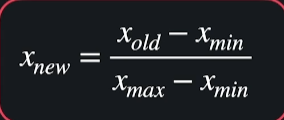

이번 토픽에서는 머신 러닝의 속도와 정확도롤 높이고 이 이론들을 scikit-learn과 pandas에서 적용하는걸 배운다.

## Frature Scaling
입력변수의 크기가 서로 차이가 클때 러닝에 방해가 될 수 있어서 한다. 경사 하강법을 좀 더 빨리할 수 있게 도와줌

## one-hot encoding
범주형 데이터들을 분석할때는 인덱스를 붙혀줘야하는데 단순히 1,2,3,4 로 해주면 원하지않게 크고 작은 값이 생긴다.
그래서 크고 작은값이 생기지 않게 하는것이다.

## 정규화
모델 과적합 현상을 방지해 준다.
함수가 급격하게 변하는 이유는 세타값이 너무 커서그런데 정규화는 그걸 방지해 준다.

### k겹 교차 검증
데이터 셋을 K개로 나누어서 트레이닝하고 테스트한다.