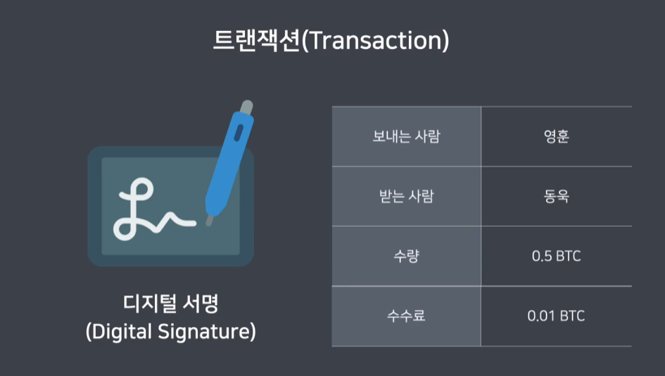

# 블록체인(Blockchain)

여러개의 블록이 체인처럼 연결되어있는것
블록은 거래데이터를 저장해둔것을 말한다. 블록체인은 블록이라는 단위로 거래 데이터를 묶어서 저장하는 데이터베이스라고 할 수 있다. 블록들의 해시값들이 서로 연결되어 있기때문에 데이터를 쉽게 조작할수 없다.

### 분산 원장
원장을 여러곳에 분산시키는것을 말한다. 원장은 거래 내역을 상세하게 기록한 문서이다. 수많은 노드에 데이터를 분산시켜둬서 시스템이 항상 안정적으로 작동한다. 

## 암호화폐
사이퍼펑크에서 일어난 화폐로 중앙은행을 거치지 않고 유저끼리 바로 거래할 수 있다. 비트코인은 채굴이라는것을 거쳐서 얻을 수 있다. 시스템에서 정해진 규칙에 따라서 거래된다. 

암호화폐를 거래하기 위해서는 주소와 개인키가 필요하다. 주소는 계좌번호, 개인키는 계좌비밀번호와 비슷하다. 개인키가 털리면 암호화폐를 털리니까 조심해야한다. 개인키로 주소를 알아낼수는 있다.

암호화폐지갑은 Hot wallet,Cold wallet 2가지로 나뉜다. Hot wallet은 인터넷에 항상 연결되어있는 계좌이고 Cold wallet은 인터넷에 연결되어있지않고 거래를 할때만 인터넷에 연결해서 사용한다.

만들어진 트랜젝션 데이터를 각 노드에 전달하면 각 노드는 유효셩을 검증하고 mempool에 있는 임시저장소에 담고 어떤 노드가 블록에 담아서 체인에 연결하면 제대로된 트랜젝션이 되고 보상으로 비트코인을 준다. 이 과정을 채굴이라고 한다.

블록체인의 51%를 통제해서 자기한테 보내는 트랜젝션을 만드는걸 51%공격이라고 한다. 하지만 블록체인에는 이걸 방지하는게 있다.이걸 훔쳐도 휴짓조각되고 훔치는거보다 정직하게 채굴하는게 더 낫다.
