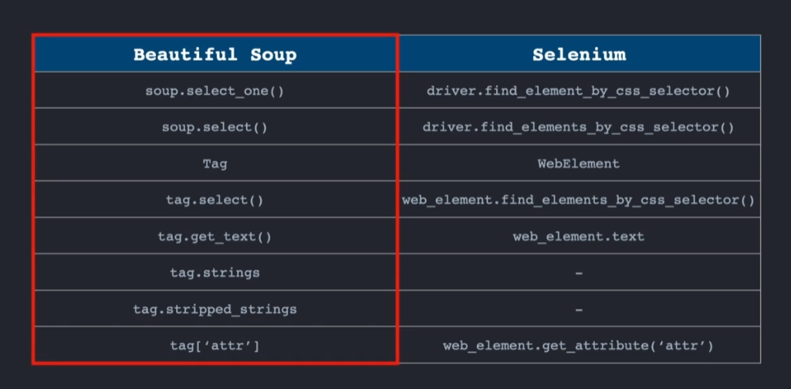

웹 자동화
==============
web 자동화를 사용해서 편하게 업무처리를 할 수 있다.

하이퍼텍스트란 글 끼리 링크걸어둔거다.
하이퍼텍스트에 있는 링크를 하이퍼링크라고 한다.
http도 Hypertext Transfer Protocol의 줄임말이고 HTML도 Hypertext Markup Language의 줄임말이다.

하이퍼텍스트를 보여줄 수 있는 전용 소프트웨어가 필요하다.(웹브라우저)
하이퍼 텍스트를 만드려면 HTML이 있어야한다.
<a href='test.html'>링크텍스트</a> 이렇게 하이퍼 링크를 달 수 있다. a Tag라고 부른다. href는 hyperlink reference의 줄임말이다.

## 웹의 확장
다른사람이 만든 링크도 쓰고싶었다 그래서 만든게 URL(Uniform Resource Locator)이다. 우리가 평소에 보는 웹페이지 주소가 URL이다.

## 웹 크롤링
한가지 웹사이트에서 연결되는 URL을 계속 타고타고 가면서 모아서 URL주소에 키워드를 붙혀준다.
웹 크롤링은 수많은 웹사이트들을 체계적으로 돌아다니면서 URL,키워드 등을 수집하는것이고 웹 스크래핑은 웹사이트에서 필요한 데이터를 긁어오는 것을 뜻한다.

## 서버와 클라이언트
서버는 웹페이지에 필요한것을 제공해주고 클라이언트는 서버에 요청을 해서 서버에서 제공해주는것을 이용한다.
서버는 클라이언트에게 HTML,CSS,JavaScript 같은것을 제공해준다.

```
import requests

response = requests.get("https://site주소.com")
test=response.text

```

https://workey.codeit.kr/ratings/index?query 쿼리쪽을 바꿔서 다른데이터를 찾을 수 있다.

## 웹 페이지 살펴보기
html의 특징은 전부다 Tag로 이루어져 있다는것이다.
되게 다양한 테그가 있다.
<P>테그는 문단을 나타낸다</P>
<HR>테그는 선을 그어준다.
한 테그에서 여러테그로 뻗어나가는게 나무가지같다해서 Tree구조라고 부른다.
상위테그 하위테그를 부모테그 자식테그라고 부른다.
태그는 속성을 가질 수 있다.

h2에 속성을 준다면 style="color = royalblue;, text-align: center" color로 색상을 정해주고 text-align으로 정렬을 해준다.
<p style="color = royalblue;"> test text</p>


## 스타일 분리하기
하나하나 바꾸기 힘들어서 css파일을 만들어서 웹사이트에 대한 규칙을 만들어서 css파일과 html을 합치면 웹페이지가 만들어지게 바꾸었다.
```
<link rel="stylesheet" href="style.css">
```
위 코드로 html파일과 css파일을 합칠 수 있다.
원하는것만 바꾸고 싶으면 html파일에 id속성을 부여하고 css파일에 #id로 하나의 파일에만 특정 속성을 입히고싶을때 사용한다. id는 꼭 1개만 가능
여러개를 바꾸고 싶으면 class를 사용하면 된다. css파일에서 .class이름 으로 만들면 된다.

b태그중에서 class값이 test인 애는 b.test로 적으면 된다.
a,b 로 적으면 a랑 b태그가 달린애들 다 선택된다.

## 크롬 개발자 도구
웹페이지에서 우클릭 후 검사 내가 원하는부분에 해당하는 HTML코드가 어디있는지 바로 알 수 있음.

### Beautiful Soup
필요한 정보만 가져와주는 외부 라이브러리이다.

pip3 install beautifulsoup4
```
soup=beautiful(rating_page,'html.parser')
print(soup.prettify())
```
rating_page에 있는 html코드를 parser로 추출하고 prettify해서 출력물을 이쁘게 만들어 준다.
print(soup.select('title'))
parser로 추출하여서 이렇게 title만 가져오는 방식이 가능하다.
```
tem_tag=soup.select('원하는tag')
for tag in tem_tag:
    file.append(tag.get_text())    
```
이런식으로 원하는태그에 들어가있는 텍스트만 리스트로 받을 수 있다.

## 데이터를 엑셀 파일로
```
from openpyxl import workbook
wb=workbook(write_only=True)
we.save('파일명.xlsx')
```
이렇게 하면 저장된다.

### CSV파일
import csv로 바로 사용가능하다.
```
csv_file=open('file_name.csv','w')
csv_writer = csv.writer(csv_file)
```
## Selenium
Selenium은 브라우저를 자동화하는 도구이다.
클릭,스크롤, 키보드 입력등이 자동으로 된다.
로그인, 검색, 버튼 클릭같은것이 자동으로 되기때문에 코드를 바꿀때마다 테스트 하지 않아도 된다.

외부 라이브러리이므로
pip3 install selenium==3.141
으로 설치해야한다.

driver=webdriver.chrome('/users/codeit/web_automation/chromedriver')
driver.get('홈페이지)
로 웹드라이버를 실행하고 홈페이지를 불러올 수 있다.

driver.fine_element_by_css_selector().click()
driver.fine_element_by_css_selector().send_keys()
이런식으로 클릭한다음 원하는값을 넣어줄 수 있다.

### Selenium Wait
Selenium을 사용하다보면 웹페이지 로딩을 기다려서 작업해야 하는게 중요하다. Wait 방식에는 2가지가 있다.
1. driver.implicitly_wait(3) : 3초동안 기다려준다. implicitly_wait은 find_element_by~ 얘네에게만 영향을 준다. 
2. time.sleep(5) : 5초동안 코드를 완전히 멈춘다.

### Selenium으로 웹 스크래핑하기

코드만 조금 바꿔서 Beautiful Soup처럼 사용하면 된다.

### javascript
웹페이지가 사용자에게 반응하는게 전부 자바스크립트라고 보면된다. 
driver.execute_script('자바스크립트 코드')로 자바스크립트 코드를 사용 가능하다.

