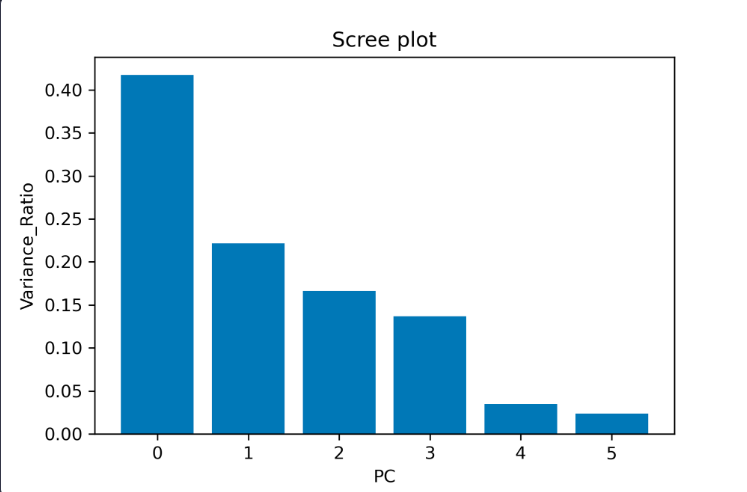

차원축소
============

데이터에서 차원은 변수의 개수를 나타낸다.
차원의 저주는 보통 데이터는 변수가 많으면 무조건 좋은거라고 생각할 수 있는데
오히려 데이터가 너무 많아지면 분석의 정확도가 떨어지는 경우가 있다.

대표적인 방법으로는 차원선택,차원추출이 있다.

차원축소는 단순하게 변수를 선택해서 고르는 것이다.
차원추출은 데이터를 잘 설명하는 차원을 선택해서 새로 만드는 것이다.

## PCA
PCA(Principal Component Analysis0)는 대표적인 차원 축소 기법 중 하나로
여러 차원들의 특징을 가장 잘 설명해주는 차원인 주성분을 이용하여 차원을 축소한다.

wine = load_wine()
df = pd.DataFrame(wine.data, columns=wine.feature_names)

### 스케일링
df_mean = df.mean()  # 각 컬럼의 평균값
df_std = df.std()  # 각 컬럼의 표준편차
scaled_df = (df - df_mean)/df_std  # 컬럼별 표준화 진행

### PCA 적용
pca = PCA(n_components=2)  # 모델 생성

pca.fit(scaled_df)  # PCA 학습
wine_pca = pca.transform(scaled_df)  # PC로 데이터 변환
pca_df = pd.DataFrame(wine_pca)  # 데이터프레임으로 변환

### 시각화
sns.scatterplot(data=pca_df, x = 0, y = 1)

이렇게 코드를 짠다.

PCA를 적용할때 몇개의 주성분으로 짜야할지 정해야 하는데 이때 scree plot을 사용한다.
scree plot은 전체 주성분의 분산대비 특정 주성분의 분산의 비율을 시각화한것으로

이런느낌이다.

기준은 PC1~PCn까지 합쳤을때 70%이상이되는 n으로 정하면 된다.

PCA만이 가지는 대표적인 특징은 데이터가 가진 중요한 정보를 최대한 보존하면서 차원을 축소한다는 점이다.