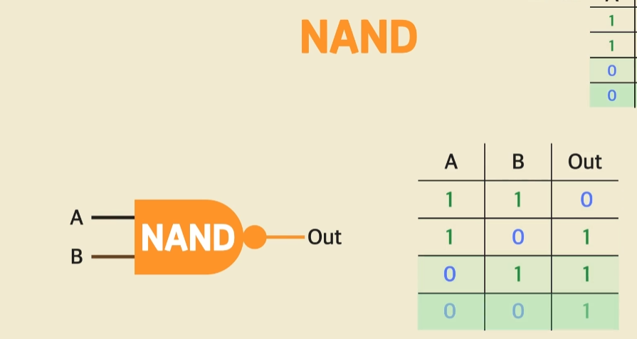
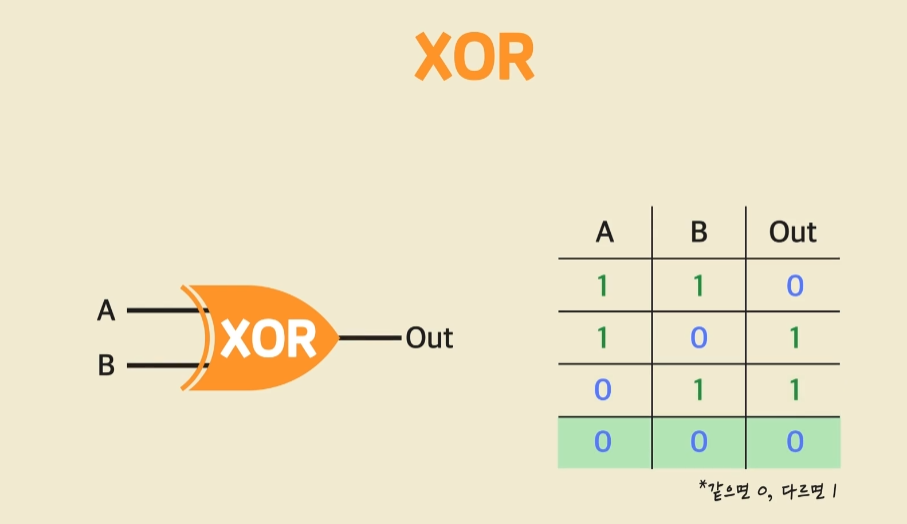

## 컴퓨터의 구조를 알아야 하는이유
개발자는 애플리케이션 개발자와 시스템개발자로 나눌 수 있다.
시스템 개발자가 보통 연봉이 높다. 애플리케이션 개발자도 컴퓨터의 구조를 알아야 좋은 애플리케이션을 만들 수 있다.

## 응용 논리 연산

## CPU란
Central processing unit 중앙처리장치로 110101110 이런 머신코드를 보내주면 CPU가 정해진 동작을 하게된다. 머신코드는 8개 짜리가 1개의 단위로 움직인다.
CPU안에는 레지스터라는 작은 저장장치가 있는데 가장 빠른 저장장치이다. 하지만 가격이 비싸서 조금만 사용한다.

머신코드는 앞의4자리 뒤의4자리로 나뉜다. 앞의 4자리는 명령어고 뒤의4자리는 값이다.