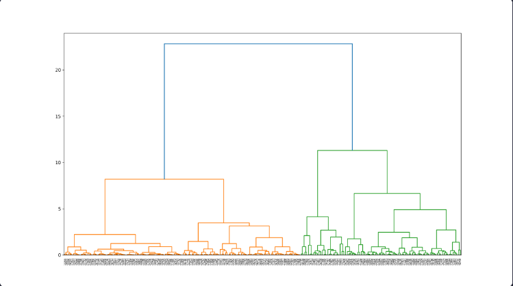

클러스터 분석
================================
클러스터링
유사한 데이터들을 같은 클러스터(집단)으로 묶어주는 작업을 말한다.

우선 데이터를 준비한다.
데이터 퀄리티 높이기에서 배운 IQR방법을 사용함.

def get_outlier_mask(df, weight=1.5):   
    Q1 = df.quantile(0.25)
    Q3 = df.quantile(0.75)

    IQR = Q3 - Q1
    IQR_weight = IQR * weight

    range_min = Q1 - IQR_weight
    range_max = Q3 + IQR_weight

    outlier_per_column = (df < range_min) | (df > range_max)
    
    is_outlier = outlier_per_column.any(axis=1)

    return is_outlier

    outlier_idx_cust_df = get_outlier_mask(sales_df, weight=1.5)

#### 아웃라이어 제거한 데이터 프레임만 추가
sales_df = sales_df[~outlier_idx_cust_df]

#### 아웃라이어 제거한 데이터프레임 시각화
sns.scatterplot(x=sales_df['total_buy_cnt'], y=sales_df['total_price'], s=200)

데이터 표준화
값-평균/표준편차로 단위가 통일되는 효과가 있다.

k-means 동작방식
k값만큼 centroid 배치하고 배치된 centroid와 가까운 데이터들을 하나의 클러스터로 묶어준다.
클러스터들이 속해있는 중심으로 centroid를 옮겨준다.
옮긴 centroid를 기준으로 가까운 데이터를 새로 묶어주고 중심으로 centroid를 옮겨주면서 반복한다.

k-means를 할때는 scikit-learn이라는 라이브러리가 사용된다.
from sklearn.cluster import KMeans

#### k-means(k=2)
model = KMeans(n_clusters=2, random_state=123)
이 코드로 모델을 선언하고

model.fit(원하는데이터) 이렇게 모델을 학습시킨다.

scaled_df['label'] = model.predict(scaled_df)
scaled_df 이걸로 각 데이터가 어떤 클러스터로 구분되었는지 알 수 있다.

그리고 클러스터를 시각화하면되는데

centers = model.cluster_centers_

sns.scatterplot(x=scaled_df['total_buy_cnt'], y=scaled_df['total_price'], hue=scaled_df['label'], s=200, palette='bright')
sns.scatterplot(x=centers[:,0], y=centers[:,1], color='black', alpha=0.8, s=400)
이걸로 시각화 할 수 있다.   

K-means 는 K의 개수가 중요하다.
centroid와 데이터 사이의 값이 작은게 좋은 데이터인데 그걸 위해서 있는게 Inertia이다.
print(model.inertia_)로 확인해볼 수 있다.

Elbow method
k값을 여러개로 한다음 for문으로 클러스터링을 돌려서
k마다 비교하고 기울기가 확 줄어드는곳으로 k값을 정한다.
inertias = []

for k in range(1, 16):
    model = KMeans(n_clusters=k, random_state=123)
    model.fit(scaled_df)
    inertias.append(model.inertia_)

k-means의 장단점
장점:어떠한 데이터에도 적용하기 쉽고, 이해와 해석이 용이하다.
단점:적절한 k의 개수를 정하는게 어렵고 이상치에 영향을 많이 받는다, 차원이 높은 데이터에 적용하면 효율이 떨어진다.

차원의 저주
변수가 많아질수록 모델의 성능은 나빠질 수 있다.
차원이 많아질수록 거리비례모델인 k-means에게 되게 안좋음

다양한 클러스터링 종류
계층 기반 클러스터링,밀도 기반 클러스터링,분포 기반 클러스터링

### 계층 기반 클러스터링
순차적으로 유사한 데이터끼리 묶어 나가는 모델

클러스터링의 장단점
미리 k의 값을 정하지않아도 똑같은 데이터가 나온다
하지만 많은 연산이 필요해서 대용량 데이터에는 맞지않다.

from scipy.cluster.hierarchy import dendrogram, linkage, cut_tree
import matplotlib.pyplot as plt
model = linkage(scaled_df, 'ward')
labelList = scaled_df.index 

덴드로그램 사이즈와 스타일 조정

plt.figure(figsize=(16,9))
plt.style.use("default")

dendrogram(model, labels=labelList)
plt.show()

cluster_num = 5

고객별 클러스터 라벨 구하기

scaled_df['label'] = cut_tree(model, cluster_num)

pd.DataFrame(scaled_df['label'].value_counts())

sns.set(style="darkgrid",
        rc = {'figure.figsize':(16,9)})

sns.scatterplot(x=scaled_df['total_price'], y=scaled_df['total_buy_cnt'], hue=scaled_df['label'], s=200, palette='bright')

### DBSCAN

밀도 기반 클러스터링 방법
이상치를 무시해버리고 복잡하거나 기하학적인 형태를 가진 데이터를 분석할 때 강하다.
고차원 데이터일수록 밀도를 계산하기 어렵고 연산이 많아져 학습속도가 느려질 수 있다.

model =  DBSCAN(eps=eps, min_samples=min_samples)
model.fit(df)
df['label'] = model.labels_

## GMM

GMM은 데이터가 서로 다른 k개의 정규분포에서 생성되었다고 가정
정규분포를 여러개 만든 후 한 데이터가 어디에 들어갈 확률이 제일 높은지 따져서 해당 클러스터로 분류함.

n_components = 4    # 분포 개수
random_state = 10   # 모델 고정

model = GaussianMixture(n_components=n_components, random_state=random_state)

#### GMM 모델 학습
model.fit(df)
df['gmm_label'] = model.predict(df)

#### 시각화
sns.scatterplot(x=df[0], y=df[1],  hue=df['gmm_label'], palette='rainbow', alpha=0.7, s=200)

클러스터링은 머신러닝중에서 비지도학습에 해당된다.